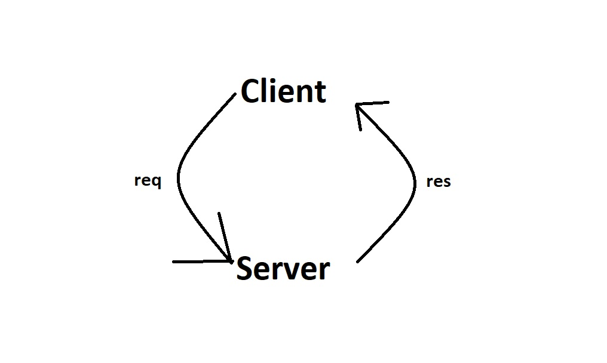

# MovieLibrary

OmarHamada

## Version I

### WRRC

### Overview

this is a simple web app for movies

### Getting Started

- Installing dependencies using "npm install"

- Starting the server : "npm start"

- Using any web browser go to get access to the local host : <http://localhost:3000/>

### Project Features

- Error handler (404,500)

- Returning a movie detalis in the home page

-------------------------------

## Version II

### WRRC 2

### Overall 2

- Installed necessary dependencies: express, axios, cors.
- Created a Movie constructor function to structure movie data.
- Implemented the following routes:
 trending movies data from The Movie DB API and returns a JSON response with movie information.
 search: Accepts a query parameter for movie search, fetches search results from The Movie DB API, and returns a JSON response with movie information.
 top-rated: top-rated TV shows data from The Movie DB API and returns a JSON response with TV show information.
 languages: available languages data from The Movie DB API and returns a JSON response with language information.

-------------------------------

## Version 3

### WRRC 3

### Overall 3

- Installed necessary dependency : pg.
- Costomized PSQL informations.
- Configured the database connection using the Pool object.
- Edited the README.md file (Capitilization and some English errors).

-------------------------------

## Version 4

### WRRC 4

### Overall 3

-Added a PUT endpoint to handle the update request.
-Added a DELETE endpoint to handle the delete request.
-Added a GET endpoint to retrieve a movie by its ID.